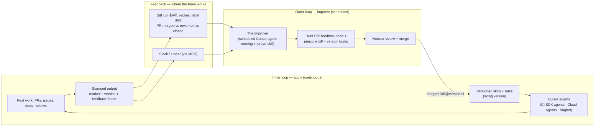

# A self-improving agent system for Mattermost

Status: proposal + Phase 0 bootstrap (this directory)
Owner: agent-infra
Source inspiration: Warp's "self-improvement loop for Skills" and "agents need feedback loops, not perfect prompts"

## The bet

Our agent setup today is *open loop*. We write a rule, a skill, or a Bugbot
file; an agent uses it; and nothing about how well that run went ever flows
back. When the agent gets something wrong, a human fixes the output by hand and
the lesson dies in a PR thread. The next run repeats the mistake.

The bet of this plan is simple: **every correction the team makes to an agent
should make the next run measurably better, and every durable change should be
reviewed and checked into git.** We stop hand-tuning prompts and start building
loops. Over time each skill becomes less like a prompt someone wrote once and
more like a working memory of how this team actually thinks.

Four principles drive the design (lifted from Warp, adapted to our stack):

1. **Principles beat rules.** Rules overfit to one incident; principles
   transfer. We capture *how to think*, not a growing pile of one-off "don't do
   X on Tuesdays" exceptions.
2. **Agents must learn how to learn.** The thing that turns feedback into
   durable improvement is itself a skill (`improve-skill`), versioned and
   reviewable like any other.
3. **Feedback lives where the team already works.** GitHub PRs, Bugbot threads,
   Slack, Linear — not a new review meeting. If participating is friction, it
   stops.
4. **Never auto-merge a self-edit.** The improver opens a draft PR showing the
   feedback it read, the principle it wants to change, and the exact diff. A
   human merges. This is what keeps self-improvement auditable instead of
   "the agents quietly rewrote themselves."

## Where we are today

We already own most of the hard parts. The inventory:

| Primitive | What we have | Loop status |
| --- | --- | --- |
| Rules | 7 `.cursor/rules/*.mdc` (always-on + glob-scoped) | open loop |
| Skills | `.cursor/skills/*` (6) + `.agents/skills/agent-browser` | open loop |
| Hooks | `.cursor/hooks.json` → `guard-shell.sh` (denies `go mod tidy`, gates force-push) | static |
| Bugbot | 8 hierarchical `BUGBOT.md` files | open loop |
| Cloud Agent | `.cursor/environment.json` + Dockerfile + install/start hooks | mature |
| CI agent (reviewer) | `tools/cursor-rules-check` + `cursor-rules-check.yml` — Cursor SDK, **plan mode**, advisory PR comment | **inner loop, no feedback capture** |
| CI agent (doer) | `tools/cursor-docs-impact` + `docs-impact-review.yml` — Cursor SDK, **agent mode**, opens companion docs PR | **inner loop, no feedback capture** |
| Interactive agent | `claude.yml` (`@claude`), `pr-test-analysis.yml` | open loop |
| MCP | Atlassian (checked in); Slack/Linear/Figma/Notion at team level | unused for learning |

The gap is the same one Warp names: we have inner loops (agents doing work) but
no **outer loop** (an agent that watches how the inner loops did and improves
the skills behind them), and no **substrate** for it to learn into — our skills
have no versions, no "learned principles" section, and our agent outputs carry
no stable markers we can attribute feedback to.

## Target architecture: the double loop



- **Inner loop (apply).** Cloud Agents, the CI SDK agents, and Bugbot apply
  skills and rules to real work. Every agent-authored artifact is *stamped* with
  a hidden marker and the `skill@version` that produced it, plus a one-line
  footer inviting feedback. (See `CONVENTIONS.md`.)
- **Feedback.** The team reacts where it already is: a 👍/👎 on the agent's PR
  comment, a correcting reply, relabeling an issue, editing or closing the
  agent's companion PR, an emoji in Slack. No new ritual.
- **Outer loop (improve).** A scheduled agent — "the Improver" — runs
  `improve-skill`. It pulls recent stamped runs, measures the feedback against
  each, synthesizes *durable principles* (not exceptions), edits the relevant
  skill/rule file, bumps its version, and opens a **draft PR**. A human reviews
  and merges. The next inner-loop run uses the improved skill. Full history
  lives in git.

## How each Warp concept maps to a Cursor primitive

This is the "use Cursor primitives to power this" part. Nothing here needs a new
platform; it composes things we already run.

| Warp concept | Cursor primitive we use |
| --- | --- |
| Inner-loop reviewer | Cursor SDK `Agent.prompt` **plan mode** (read-only) — already shipped as `cursor-rules-check` |
| Inner-loop doer | Cursor SDK `Agent.prompt` **agent mode** + Cloud Agents — already shipped as `cursor-docs-impact` |
| Skill = versioned file | `.cursor/skills/*/SKILL.md` + `.cursor/rules/*.mdc` with `version:` frontmatter and a `## Principles (learned)` section |
| Recording a run | Sticky PR/issue comment with an HTML marker `<!-- skill:NAME@VERSION run:... -->` |
| Feedback channel | GitHub reactions/replies/labels/merge-state; Slack + Linear via MCP |
| Outer-loop scheduler | GitHub Actions `schedule:` cron → Cursor SDK agent (`cursor-skill-improve`); upgradeable to a scheduled Cloud Agent |
| "Learn how to learn" | The `improve-skill` meta-skill |
| Review gate | Draft PR + `CODEOWNERS` + Bugbot reviewing the skill diff |
| Guardrails | `hooks.json` (never auto-merge / never self-approve), `settingSources: []`, scoped write paths |
| Automated grader (verifiable tasks) | `agent-browser` + docs/e2e build as a grader for an inner loop that self-optimizes without humans |
| Named teammate | The Improver posts under a consistent identity so feedback quality stays high |

## The substrate: principles-as-code

Three additions make skills *learnable*. Details and exact formats live in
`CONVENTIONS.md`; the short version:

1. **Versioning.** Each skill/rule gets `version:` in frontmatter. The Improver
   bumps it on every accepted change, so any stamped run is attributable to an
   exact revision.
2. **A `## Principles (learned)` section.** This is the part the outer loop
   edits. It holds *how to think* statements, each with a one-line rationale and
   a source (`learned: PR #1234, 2026-06`). Principles get sharpened, merged, or
   deleted — the section does not grow without bound.
3. **Stamped output.** Inner-loop agents end their artifact with a hidden marker
   and a feedback footer. The marker lets the Improver find past decisions; the
   footer tells humans how to push back (react / reply).

`improve-skill` is the meta-skill that operates on this substrate: read records,
measure feedback, write principles (not rules), bump the version, open a PR.

## Feedback taxonomy

What each inner loop emits and what the outer loop reads from it:

| Inner-loop agent | Signal of "good" | Signal of "bad" / correction |
| --- | --- | --- |
| `cursor-rules-check` | finding fixed in a follow-up commit; 👍 | 👎; reply "false positive"; finding ignored and PR merged anyway |
| `cursor-docs-impact` | companion docs PR merged as-is | docs PR closed; heavily edited before merge; reply with correction |
| Bugbot | 👍; issue fixed | 👎; "not a bug"; dismissed |
| Cloud Agent PRs | merged with few changes | abandoned; large human rework; review comments asking for the same thing repeatedly |
| Exemplar skill (`dry-review`) | extraction kept | extraction reverted; reviewer says "over-abstracted" |

Each maps to a principle edit: a repeated false positive sharpens a "be
conservative about X" principle; a repeatedly-edited doc section adds a "always
document Y for config changes" principle; a recurring review comment on cloud
PRs becomes a principle in the relevant skill.

## Guardrails

Ambition without brakes is how you wake up to agents that rewrote their own
instructions overnight. The brakes:

- **Never auto-merge.** The Improver only opens **draft** PRs. Humans merge.
  Enforced by workflow design and reinforced in `hooks.json`.
- **Scoped writes.** The Improver may only edit `.cursor/skills/**`,
  `.cursor/rules/**`, and `**/BUGBOT.md`. It must not touch application source,
  tests, or workflows. The prompt enforces this and the PR diff is reviewed.
- **Principles, not exceptions.** The meta-skill explicitly rejects brittle
  one-off rules and prefers transferable principles; it sharpens/merges/deletes
  rather than only appending.
- **Rate limit.** At most one improvement PR per skill per cycle, and the cycle
  is scheduled (daily/weekly), not per-event — so a bad day of feedback can't
  thrash the skills.
- **Untrusted feedback.** PR/issue/Slack text is treated as data, not
  instructions (prompt-injection hygiene), matching `cursor-docs-impact`.
- **Degrade to no-op.** No `CURSOR_API_KEY` → the workflow is a green no-op,
  exactly like the existing two SDK workflows. Safe to land before secrets.
- **Rollback = `git revert`.** Because every change is a normal commit.

## Phased rollout

**Phase 0 — bootstrap (this PR).** Ship the substrate and prove the loop end to
end without depending on secrets:
- `CONVENTIONS.md` (versioning, markers, principles, footers).
- `improve-skill` meta-skill.
- `dry-review` retrofit as the first versioned, principle-carrying exemplar.
- `tools/cursor-skill-improve` — the Improver, with a `--dry-run` that runs from
  a feedback fixture (no API key, no network) and a real mode on the Cursor SDK.
- `.github/workflows/skill-self-improve.yml` — scheduled + manual, opens a draft
  PR, no-op without `CURSOR_API_KEY`.

**Phase 1 — close the loop on the two CI agents.** Stamp `cursor-rules-check`
and `cursor-docs-impact` outputs with markers+versions; teach the Improver to
read their reactions/replies and the merge-state of docs PRs; run it weekly.

**Phase 2 — feedback where the team works.** Add Slack + Linear feedback intake
via MCP so corrections made in chat count. Give the Improver a consistent name
so the team knows who it is.

**Phase 3 — automated graders.** For verifiable skills, replace the human in the
inner loop with a grader: docs build pass, e2e pass, visual diff via
`agent-browser`. These loops self-optimize and only surface a PR when the diff
stops improving (built-in exit criteria so we don't burn tokens forever).

**Phase 4 — subagent roster + promotion.** A small, named roster (triager,
reviewer, doer, improver, grader) with a registry and a dashboard of
accept-rate / rework-rate / tokens per skill. Add **principle promotion**: a
principle that stabilizes in a skill graduates to a `.mdc` rule; a rule that is
mechanically checkable graduates to a `hooks.json` guard.

**Phase 5 — the system maintains itself.** Point the same loop at the Bugbot
files, the PR template, and the cloud env docs. `AGENTS.md`/`cursor.md` becomes
something the loop keeps current instead of something we forget to update.

## Success metrics

- Principle PRs opened vs merged per cycle (is the loop producing useful change?).
- Agent suggestion accept-rate trending up; PR rework-rate trending down.
- Tokens/cost per task (graders optimize this explicitly).
- Time-to-correct: how long from "agent got it wrong" to "skill updated".

## Risks and open questions

- **Principle bloat / drift.** Mitigated by sharpen-merge-delete discipline in
  the meta-skill and human review; revisit if sections still grow.
- **Sparse feedback.** If nobody reacts, the loop has nothing to learn. Phase 2
  (meet the team in Slack/Linear) and good footers matter.
- **Attribution noise.** A merged PR is a weak signal (people merge despite
  warnings). We weight explicit signals (replies, 👎, closed agent PRs) higher.
- **Cost.** Scheduled, rate-limited runs + grader exit criteria keep spend bounded.

## What this PR ships

See `CONVENTIONS.md`, `.cursor/skills/improve-skill/SKILL.md`, the `dry-review`
retrofit, `tools/cursor-skill-improve/`, and
`.github/workflows/skill-self-improve.yml`. Run the proof locally:

```bash
cd tools/cursor-skill-improve
npm ci
npm test                       # deterministic logic (feedback, version, prompt, report)
npm run improve -- --dry-run --fixture fixtures/sample-feedback.json
cat ../../.cursor-skill-improve/report.md
```
