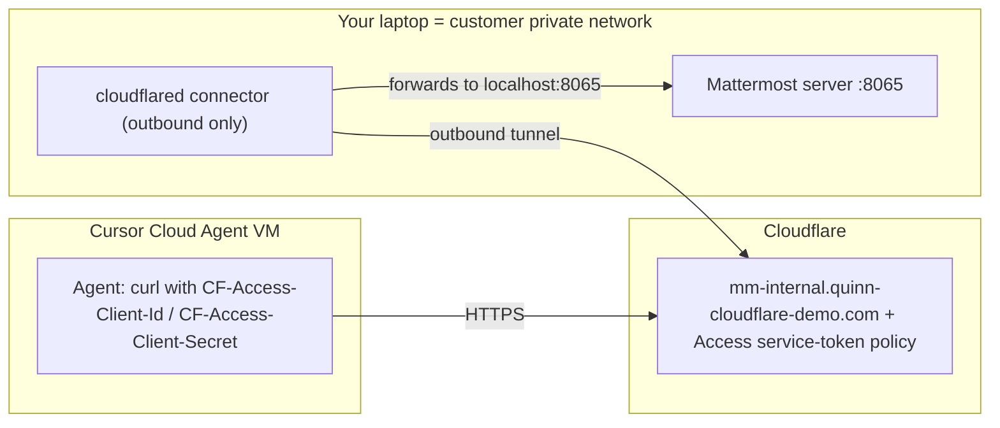

# Cloudflare Tunnel demo for Cursor Cloud Agents

This demo shows a Cursor Cloud Agent reaching a private Mattermost server through
a Cloudflare Tunnel, without exposing that server to the public internet. The
Mattermost dev server on your laptop stands in for a service that a customer
would run inside a VPC or intranet.

It implements the pattern documented in Cursor's
[Cloud Agent setup guide](https://cursor.com/docs/cloud-agent/setup#running-cloudflare-tunnel).

## What it demonstrates

- A Cloud Agent can reach a private HTTP service over an authenticated hostname.
- The connector makes only outbound connections to Cloudflare. The origin needs
  no inbound firewall rule and is not published to the public internet.
- Access to the hostname is gated by a Cloudflare Access service token, and the
  token values live in Cursor Secrets rather than in the repository.

## Architecture



## Prerequisites

- A Cloudflare account with a domain you control on Cloudflare.
- Docker Desktop, or `cloudflared` installed natively (`brew install cloudflared`
  on macOS, recommended: see [Running the connector](#3-start-the-connector)).
- The Mattermost dev server, runnable from this repo (`cd server && make run-server`).

## One-time Cloudflare setup

You do this once in the Cloudflare dashboard. It is not automated from the repo
because it provisions account-level resources. The current demo already uses the
hostname `mm-internal.quinn-cloudflare-demo.com`.

### Stage 1: Create the named tunnel

1. Open the Zero Trust dashboard at [one.dash.cloudflare.com](https://one.dash.cloudflare.com).
2. Go to **Networks > Tunnels > Create a tunnel** and choose **Cloudflared**.
3. Name it (for example `mattermost-demo`) and save.
4. On the connector install screen, copy the **tunnel token** (the value after
   `--token`). Keep it out of the repo; it goes in your local `.env`.

### Stage 2: Route a hostname to the local server

In the tunnel's **Published application routes** (or **Public Hostname**) tab:

- Subdomain `mm-internal`, your domain, giving `mm-internal.<your-domain>`.
- Service type `HTTP`, URL `localhost:8065`.

Cloudflare creates the DNS record automatically. This maps the hostname through
the tunnel to `http://localhost:8065` on whatever machine runs the connector.

### Stage 3: Create the Access service token

1. Go to **Access > Service auth > Service tokens > Create service token**.
2. Name it (for example `cursor-cloud-agent`) and choose a duration.
3. Copy the **Client ID** and **Client Secret** now. Cloudflare shows the secret
   only once.

### Stage 4: Protect the hostname with an Access application

1. Go to **Access > Applications > Add an application > Self-hosted**.
2. Set the application hostname to the one from Stage 2.
3. Add a policy with **Action: Service Auth** and a **Service Token** selector
   that matches the token from Stage 3.
4. Save.

With this policy, a request without the token headers receives a Cloudflare
Access challenge, while a request that presents the service token is allowed
through to the origin.

## Cursor Secrets

Add these in the Cursor dashboard under **Cloud Agents > Secrets** so Cloud
Agents receive them as environment variables:

| Secret | Value | Notes |
| --- | --- | --- |
| `MM_TUNNEL_URL` | `https://mm-internal.<your-domain>` | Public hostname; not secret |
| `CF_ACCESS_CLIENT_ID` | Access service token client id | |
| `CF_ACCESS_CLIENT_SECRET` | Access service token client secret | Mark as redacted |

## Run the demo locally first

Verify the tunnel end to end from your laptop before involving a Cloud Agent.

### 1. Configure local variables

```bash
cd demos/cloudflare-tunnel
cp .env.example .env
# edit .env: paste CLOUDFLARE_TUNNEL_TOKEN, CF_ACCESS_CLIENT_ID, CF_ACCESS_CLIENT_SECRET
```

### 2. Start Mattermost

```bash
cd server
make run-server
# healthy when: curl http://localhost:8065/api/v4/system/ping returns {"status":"OK"}
```

### 3. Start the connector

In another terminal:

```bash
cd demos/cloudflare-tunnel
./run-connector.sh
```

The script prefers a native `cloudflared` binary and falls back to Docker with
host networking. On macOS, prefer the native binary (`brew install cloudflared`):
Docker Desktop host networking is unreliable, and a containerized connector
resolves `localhost` to the container rather than your laptop.

### 4. Verify through the tunnel

In a third terminal:

```bash
cd demos/cloudflare-tunnel
./verify-from-anywhere.sh
```

A `HTTP 200` with a `{"status":"OK", ...}` body confirms the full path works.

Optionally, open `https://mm-internal.<your-domain>` in a browser. Without the
service token you get a Cloudflare Access page, which shows the hostname is
gated. This contrast is a useful part of the demo.

## Run the Cloud Agent demo

1. Commit these changes on a branch (this work is on `tunnel`) and push it.
2. Confirm the three Cursor Secrets are set for the environment.
3. Keep `make run-server` and `./run-connector.sh` running on your laptop.
4. Launch a Cloud Agent from the branch and give it a prompt such as:

   > Verify you can reach our internal Mattermost through the Cloudflare tunnel,
   > then report the server version and status.

The agent runs `.cursor/scripts/check-private-service.sh` (or the equivalent
`curl`), reaches the private server, and reports back. Meanwhile the origin is
only listening on your laptop's localhost.

### Suggested talk track

- The service runs on my laptop and listens only on localhost. Nothing about it
  is published to the internet.
- The connector opens an outbound tunnel to Cloudflare. There is no inbound
  firewall rule and no open port on the origin.
- Cloudflare Access gates the hostname. Only a caller with the service token gets
  through, as the browser challenge shows.
- The Cloud Agent holds the token as a Cursor Secret, not in the repo, and calls
  the hostname like any other HTTPS endpoint.
- The same pattern points at a real service in your VPC by changing the tunnel
  route and the allowlist.

### Optional: post a message from the agent

Add a Mattermost personal access token as a Cursor Secret and have the agent post
to a channel through the tunnel. The message appears live in your local
Mattermost UI, which makes the round trip visible on a call.

## Troubleshooting

| Symptom | Likely cause | Fix |
| --- | --- | --- |
| `verify` prints `000` | Connector or DNS not ready | Confirm `./run-connector.sh` is running and `MM_TUNNEL_URL` is correct |
| `HTTP 403` | Access token rejected | Recheck `CF_ACCESS_CLIENT_ID` / `CF_ACCESS_CLIENT_SECRET` and the Service Auth policy |
| `HTTP 502` / `503` / `530` | Tunnel up, origin down | Start `make run-server`; confirm it serves `localhost:8065` |
| Docker connector cannot reach origin | Container `localhost` is not the host | Use native `cloudflared` (`brew install cloudflared`) |
| Agent cannot resolve the hostname | Restricted egress environment | Add the hostname to the Cloud Agent network allowlist |

## Security notes

- Keep the tunnel token and the Access service token out of the repository. Use
  the local `.env` (gitignored) and Cursor Secrets.
- Rotate tokens created for a proof of concept once testing is done.
- The connector needs no inbound ports. It makes outbound connections to
  Cloudflare only.
- This environment uses unrestricted egress, so no allowlist change is required.
  In a restricted-egress environment, add the tunnel hostname to the Cloud Agent
  network allowlist.
